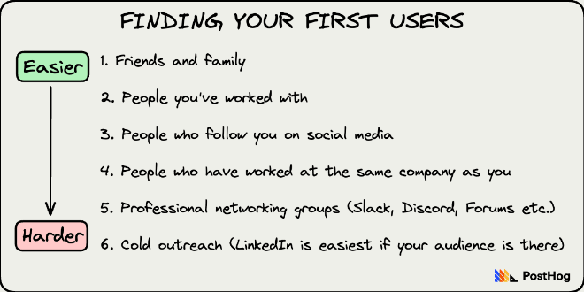
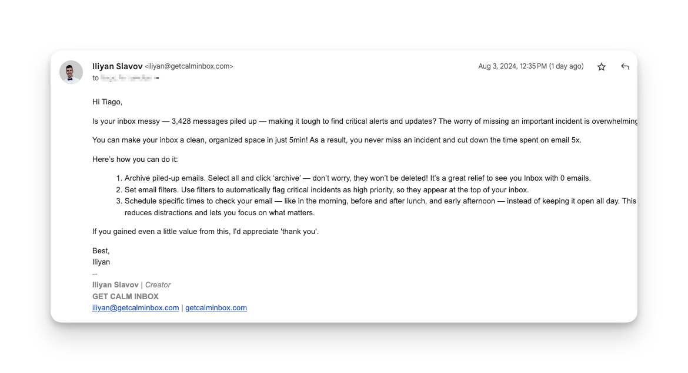

# The Letter

Hi, I'm Iliyan, a seasoned software programmer. Like many of us in the tech world, I’ve always struggled when it came to marketing my own side ventures. That’s why I decided to collect and organize my thoughts into this marketing letter for myself. It’s designed to help developers like us confidently navigate social media, networking, and content creation.

The hard truth is, marketing is a necessity. It’s the key to getting your product noticed, attracting your first customers, and building a standout brand. I know how tough it can be for a developer to shift gears and think about marketing. But just like the great book *It Doesn't Have to Be Crazy at Work* by 37signals, I believe marketing doesn’t have to be overwhelming for us either.

In this letter, you’ll find a collection of thoughts and nuggets of wisdom I’ve picked up from others and through my own experiences. The intent is to serve as a roadmap and quick reference for those moments when you need a bit of guidance in your marketing efforts.

**Table of Contents**
1. [Introduction](#introduction)
2. [Principles](#principles)
3. [Crafting compelling content](#crafting-compelling-content)
4. [Don’t fear validation](#dont-fear-validation)
5. [Finding your first users](#finding-your-first-users)
6. [Pulling users in, not pushing them away](#pulling-users-in-not-pushing-them-away)
7. [Crafting your positioning statement](#crafting-your-positioning-statement)
8. [Build a personal brand on a social platform](#build-a-personal-brand-on-a-social-platform)
9. [Consistency beats hacks & trends](#consistency-beats-hacks--trends)
10. [Marketing Week](#marketing-week)
11. [Emailing (you focused approach)](#emailing-you-focused-approach)
12. [Just one hour a day (it shouldn’t be a full-time job))](#just-one-hour-a-day-it-shouldnt-be-a-full-time-job)
13. [Bucket of ideas (when you stuck)](#bucket-of-ideas-when-stuck)
14. [Don’t follow the crowd](#dont-follow-the-crowd)
15. [Have fun](#have-fun)

## **Introduction**

Dear Self,

I wrote this marketing handbook for you, so you can read it and have it as a pocket reference. Remember, the goal of marketing is to help you or your product get noticed.

## **Principles**

Marketing can take many forms, including promotions, direct communications, advertising, product positioning, placement, and distribution choices. 

As a non-marketing expert, it’s important to stick to your principles and avoid activities you don’t want to spend time on.
- Don’t publish content you wouldn’t share yourself
- Don't make claims that are not entirely true and verifiable
- Avoid making speculative claims about potential future updates
- Don't neglect the core product for marketing
- Don't bombard customers with deals, pop-ups, and other dark patterns. These devalue our product in the long run
- Don't criticize your competitors
- Don't make false claims about your competitors

Back in time, you realized the importance of committing to strategies you could maintain over an extended period of time. Marketing is a marathon, not a sprint. Also an experiment game. So, focus on sustainable tactics that you can consistently execute for the long haul.

For instance, with your Twitter channel, you only managed to keep it up for a few weeks and made just a handful of posts. You found it super challenging to come up with ideas for posts, and it honestly wasn't enjoyable at the end. That experience taught you the value of finding marketing methods that align with your interests and strengths.

## **Crafting compelling content**

Competing with larger companies based on the amount of content you produce is a losing battle. Instead, concentrate on creating high-quality content. Right now, you’re not Zappier, and that’s okay. Remember, one great article is worth more than 25 mediocre ones. Quality content performs better over time, especially when it comes to SEO. Think of your writing like a venture capitalist thinks about investments: spend time updating and improving your best pieces.

Always ask yourself: "Is this content genuinely useful to the target audience?" This question applies to everything you write, including SEO articles. Good keywords are not enough if the content isn’t helpful. People are overwhelmed with information and don’t have time for fluff. Remember, content is not just a marketing tool, it’s the foundation for building lasting relationships.

## **Don’t fear validation**

You may be afraid of validating your idea, but it is critical to overcome this fear. The key is to test your concept quickly and gather real feedback. You should focus on developing tangible products and recruiting real users. It's important to keep in mind that users' behavior often diverges from your initial expectations. As Jason Fried wisely puts it, “You can't validate something that doesn't exist.” You need to be quick in this process. Getting initial usage—no matter how raw or imperfect—is crucial. It will help you determine whether your concept is compelling enough that early users are willing to endure some initial pain in pursuit of a solution to their problem.

## **Finding your first users**

Before you start your search, make sure you have a plan for finding your initial users. You don't need an exhaustive blueprint, but it’s important to have a clear idea of who your users are and how to reach them. Be prepared to explore multiple channels, as not every approach will work. When you reach out, keep your requests short and to the point. Aim for two or three sentences, not a wall of text. Be direct about your intentions; clearly state if you’re seeking feedback or if you’re looking to sell. Remember, having a deadline helps. It gives you a reason to push yourself. Without that deadline, it’s easy to lose your focus, and as you know, finding those first users can be tough.

## **Pulling users in, not pushing them away**

Customers will evaluate you first and foremost based on your product. Pushing customers into using your product won’t lead to long-term success.

If a customer doesn't choose your product, that means either:

1. The product isn't good enough
2. The product isn't the right solution for them
3. You didn't communicate the benefits of the product well enough

Don’t fall into the trap of thinking that companies will keep long-term customers just because they spam them with generic content. Don’t forget that lasting relationships are built on genuine value and meaningful engagement.

## **Crafting your positioning statement**

This is about how you position your product against others in your target market. A positioning statement typically consists of one or two sentences that highlight your product's primary appeal and its place in the market.

**Start by writing a concise statement about your product**, often referred to as your “elevator pitch.” This pitch should clearly communicate the concept of your product in just two to three sentences, capturing its essence and what makes it interesting and compelling.

Don’t stress about finding the perfect wording right away or trying to create the most clever tagline. Focusing too much on perfection will only lead to writer’s block. Remember, you’ll likely refine and tweak your statement multiple times before presenting it to actual prospective customers or partners.

## **Build a personal brand on a social platform**

These days, people buy from people they relate to, trust, and like.

As a one-person business owner, your personal brand is a powerful asset that can help you connect with your target audience, establish credibility, and drive business growth.

One of the most effective ways to build your personal brand is by showing up and posting content online.

Remember, building a personal brand takes time and consistency. So don't get discouraged if you're not seeing traction right away.

Let your personality shine through in your online presence. It's much easier for people to relate to you if they feel like they're getting to know the real you.

## **Consistency beats hacks & trends**

Start with the handful of channels that you *personally use and understand*. If you’re a Twitter person but rarely use Facebook and can’t comprehend the interest of Pinterest, then spend a few months trying to build a corporate Twitter presence and buy Twitter ads. So, stay with what you know, where you’re comfortable, and focus on doubling your business on that channel. Sometimes, getting outside your comfort zone is wrong. Spreading yourself thin is even more wrong.

Don’t treat it like an assembly line you’re pushing content through in exchange for likes. Instead, treat it like you’re talking to a bunch of human beings you care about and who you genuinely want to help.

As a huge bonus: you’ll be less worn out because you’re focused on just **one** social network and just **one** group of friends. It’s much less overwhelming that way.

## **Marketing Week**

Think back to when you discovered John from Bannerbear and his innovative approach to balancing coding and marketing. Just like you, John is a technical founder who loves the building process more than marketing and promoting the product.

He divides his time into two-week cycles, and it's a nice routine to follow as a tech guy:

**Week 1:** Focus solely on coding and building features for your SaaS product.

**Week 2:** Transition to marketing—promote your work, share insights, and engage in any activity that relates to marketing.

During marketing week, John suggests considering the following activities:

- Tweet something of interest to your target market.
- Participate in forums where your customers are active.
- Improve your marketing site and documentation.
- Create a free tool that complements your app.
- Write a blog post aimed at your target audience.
- Write a weekly or monthly newsletter with tips and advice.

This simple split helps reduce mental overhead. Remember, the more complicated you make it, the harder it becomes to stick to your routine. So keep it straightforward: one week for coding and one week for marketing. Do you remember, you’ve tried this approach before and gained some small victories with one of your early products? 

## Emailing (you focused approach)

Paid advertising is becoming increasingly expensive. Consider an email campaign that costs about $100 but can yield results similar to a $10,000 ad budget. Everyone has an email account—yes, even the Pope, the President, and your grandma! Email campaigns are quick to launch, cheap to run, and allow you to target specific audiences. Plus, they're predictable and not reliant on third-party algorithms.

Remember: **Don’t blast your audience.** No one likes being bombarded with mass emails.

When crafting your emails, remember to make them “you”-focused instead of “I”-focused. Center your message on the recipient, not your business. Whether you’re promoting your services as a consultant, pitching a guest article, or sharing new content, always keep the recipient in mind.

## **Just one hour a day (it shouldn’t be a full-time job)**

You don’t need to invest your entire day to make meaningful progress. Just one focused hour a day can be incredibly effective. Here’s a simple weekly action plan to maximize that hour, using specific tasks to enhance your visibility and network:

Here's an example of weekly activity schedule 👇

Monday: Social Media Engagement
- Post: Share an insightful article or your thoughts on a recent development trend.
- Comment: Engage with others’ posts in your field—offer insights or ask questions.
- Follow People: Identify and follow influential developers or thought leaders.

Tuesday Activity: Visual Content
- Create GIFs: Capture your work process in GIFs to showcase your skills and projects.
- Work Screen: Share a screenshot of your current project or workspace.
- Figjam: Use Figjam for quick visual brainstorming and annotate with brief text.

Wednesday Activity: Networking
- Chat with Other Developers: Reach out to fellow developers in your network.

Thursday Activity: Short Post Creation
- Write a Short Post (300-400 words): Share an experience, tutorial, or insights.
- Cross-Post: Share it across your social media platforms for broader reach.

Friday Activity: Content Repurposing
- Repurpose Old Content: Update older blog posts or tutorials and share again.

Remember, even just one hour a day can lead to meaningful development in your professional presence and connections. Stay focused, and enjoy the process!

## **Bucket of ideas (when you stuck)**

When you're feeling stuck as a SaaS founder, consider these actionable marketing ideas to boost your visibility and engage your audience:

1. **Content Creation:**
   - Write a blog post addressing customer pain points.
   - Create memes that highlight your customers’ challenges.
   - Draft tweets or threads related to your customers' struggles.
   - Write about the challenges you face
   - Record videos discussing niche problems or creating tutorials for your product.
2. **Website Optimization:**
   - Optimize your landing page for conversions.
   - Improve your website's SEO for better visibility.
   - Add shareable sections and features to your landing page.
3. **Community Engagement:**
   - Engage with relevant communities on Slack, Reddit, and Facebook.
   - Talk to your best users for insights and feedback.
   - Participate in forums where your target customers are active.
4. **Email Marketing:**
   - Create onboarding email sequences for new users.
   - Develop drip email campaigns to nurture leads.
   - Write and distribute a regular newsletter with tips and advice.
5. **Promotions and Launches:**
   - Run giveaways to engage your audience.
   - Launch your product on platforms like Product Hunt and promote it on social media.
6. **User Support and Resources:**
   - Build a help center to assist users.
   - Improve your marketing site and documentation.
7. **Social Media Engagement:**
   - Establish a brand Twitter account and share interesting content.
   - Engage with industry discussions and relevant tweets.
   - Share personal stories on your progress, milestones, and setbacks
   - DM individuals who might benefit from your product.

## Don’t follow the crowd

When you write, sound, or act like everyone else, you send a clear message: "Our products are just like everyone else’s." You know this feeling well—most corporate websites and brochures simply don't leave a lasting impression. Consider the overused phrases that dominate the landscape, such as "effective end-to-end solutions," "provider of value-added services," and "full-service solutions provider." They lack authenticity and fail to inspire.

It’s easy to get swept up in buzzwords, especially when marketers and sales professionals throw around terms like “2x-ing” or “10x-ing” your revenue. But here’s the truth: there’s real power in honesty. Instead of grand claims, sometimes it’s more effective to say, “I can probably help you grow by 3-5%.”

So, embrace what makes you unique. Ditch the bland jargon and focus on clear, genuine communication. Your authenticity will resonate more with your audience and set you apart from the crowd.

## Have fun

My final tip is to have fun with this journey. 

Seriously, there’s no point in doing something if you don’t like it.

It’s about the experiences and the learning, not just results.

Have fun!

[Back to the top](#letter)